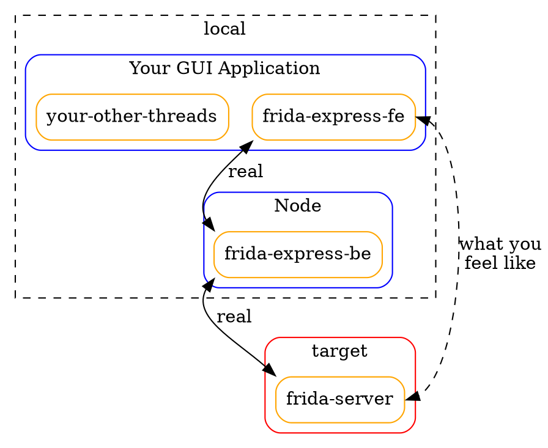

# Frida-Express

This project is a dependent project of [fridbg]() (my another project which is still under development).

However, if you want to develop a frida tool with gui, then this project may be of some help to you.

## why

I want to develop an all-in-one debugging tool with gui based on frida.

Unfortunately, tauri is backend in rust, and frida-rust's bindings are not comprehensive. The abi version of electron is always different from the abi version bound to electron officially compiled by frida. I'm not that familiar with electron, and adjusting the electron version confuses me.

Therefore, a simple idea is to start a node runtime when the application is running to actually control the behavior of frida. At this point you only need to write the front end for this node runtime. That's how this project was born.

## how it works

This project contains both front-end and back-end, and as the name suggests, the project is based on express.

- back-end:
    I adapted the interface in frida-node to an interface based on the express service and exposed it as an http interface. This is the backend of the project. All calls from the front end are converted to post form, with a form passing parameters attached.

- front-end:
    The front-end project is used to wrap these request interfaces. And it remains consistent with the interface in frida-node, so that the user's code can run seamlessly without any adjustments.

- other important things:
    Uuid is used internally to track instances for garbage collection, cross-process synchronization and other operations.
    Websocket is used to implement the send function and the rpc call of script.exports.



## install

```bash
git clone 
cd frida-express
yarn
```

then use it in your own project.

## contribution

Thank you for considering contributing to the project!

Please feel free to submit an issue, or submit a PR. If you have suggestions, you can contact me directly, or explain it in the issue. I will try my best to help you.

## license

[MIT](./license)

## contact

If you have any questions, suggestions, please contact me:
- github：[Ivory](https://github.com/tiwe0)
- email：[contact@ivory.cafe](contact@ivory.cafe)

## thanks

Thanks to frida and myself and all of you!
